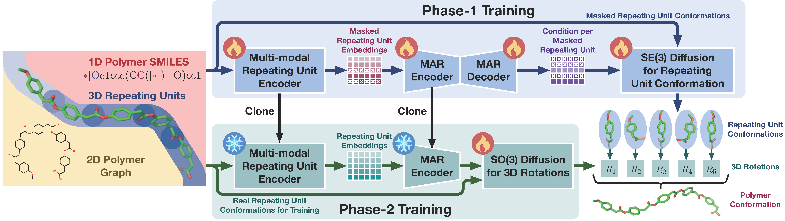
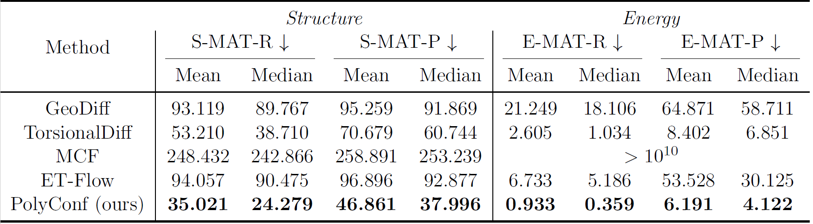

<div align=center>

# ⚡️PolyConf: Unlocking Polymer Conformation Generation through Hierarchical Generative Models (ICML 2025)

[](https://arxiv.org/abs/2504.08859)
[](https://drive.google.com/file/d/1FXUOUEcjdJLC68SCpnYMcrzGzOAK7sa6/view?usp=drive_link)
[](https://polyconf-icml25.github.io/)
[](https://bohrium.dp.tech/apps/polyconf)
[](LICENSE)

</div>

## 🚀 Introduction
Our <span style="color:red">**Polyconf**</span> achieves <span style="color:red">**state-of-the-art**</span> performance in polyconf conformation generation. In particular, our PolyConf decompose the polymer conformation into a series of local conformations (i.e., the conformations of its repeating units), generating these local conformations through an autoregressive model, and then generating their orientation transformations via a diffusion model to assemble them into the complete polymer conformation, thereby effectively accommodating their unique structural characteristics.
<p align="center" style="margin-top: 0px;">
  
</p>
<p align="center" style="margin-top: 0px;">
  
</p>

## ⚒️ Environment
The required packages have been listed in `requirements.txt`.
To set up your environment, please execute:
``` cmd
pip install -r requirements.txt
```

## 📦 Dataset
The processed dataset has been provided in this [link](https://drive.google.com/file/d/1Z51iJy2EQEGK1KVxR3KgHZQNjBBpf75T/view?usp=drive_link), please download this dataset and organize the `./dataset` directory as follows:
```
dataset
├── true_confs
├── dict.txt
├── test.lmdb
├── valid.lmdb
├── train.lmdb
├── test_data_index.csv
```

## 💪 Experiments
### Training
Our model weight has been provided in this [link](https://drive.google.com/file/d/1FXUOUEcjdJLC68SCpnYMcrzGzOAK7sa6/view?usp=drive_link). If using ours, please place it in the `./phase2_ckpt` folder and rename it to `checkpoint_best.pt`.

Of course, you can also train from scratch by running the following scripts.
``` cmd
bash train_phase1.sh
bash train_phase2.sh
```

### Inference
``` cmd
bash inference.sh
```
### Evaluation
``` cmd
python extract_confs.py
python eval.py 
```

## 👍 Acknowledgments
This code is built upon [Uni-Mol](https://github.com/dptech-corp/Uni-Mol), [Uni-Core](https://github.com/dptech-corp/Uni-Core), [MAR](https://github.com/LTH14/mar), [MolCLR](https://github.com/yuyangw/MolCLR), [TorsionalDiff](https://github.com/gcorso/torsional-diffusion) and [FrameDiff](https://github.com/jasonkyuyim/se3_diffusion).
Thanks for their contribution.

## 📌 Citation
If you find this work useful for your research, please consider citing it. 😊
```bibtex
@inproceedings{wang2025polyconf,
      title={PolyConf: Unlocking Polymer Conformation Generation through Hierarchical Generative Models}, 
      author={Fanmeng Wang and Wentao Guo and Qi Ou and Hongshuai Wang and Haitao Lin and Hongteng Xu and Zhifeng Gao},
      booktitle={International Conference on Machine Learning},
      year={2025},
      organization={PMLR}
}
```
